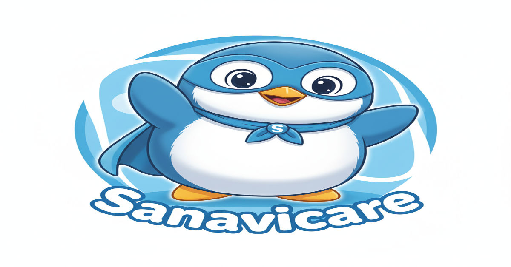

# 🐧 Sanavicare – Your AI-Powered Health & Wellness Companion

<div align="center">



**Your friendly AI companion for fitness, nutrition, disease awareness, and mental health**

[](https://choosealicense.com/licenses/mit/)
[](https://reactjs.org/)
[](https://www.typescriptlang.org/)
[](https://vitejs.dev/)

[Demo](https://sanavicare.vercel.app) · [Report Bug](https://github.com/yourusername/sanavicare/issues) · [Request Feature](https://github.com/yourusername/sanavicare/issues)

</div>

---

## 📖 About

**Sanavicare** is an AI-driven health and wellness web application designed to empower users to take control of their **fitness, nutrition, disease risk awareness, and mental health**. With a modern, intuitive interface and **Sanavi the Penguin** 🐧 as your guide, managing your health has never been more friendly and accessible.

> ⚠️ **Current Status:** This repository contains the **frontend application**. The backend (featuring advanced AI, data storage, and real-time health analysis) is under active development and will be integrated soon.

---

## ✨ Features

### Current (Frontend v1.0)

- 🎨 **Beautiful UI/UX** – Built with Tailwind CSS and shadcn/ui components
- ⚡ **Lightning Fast** – Powered by Vite for instant hot module replacement
- 📱 **Fully Responsive** – Mobile-first design that works on all devices
- 🐧 **Meet Sanavi** – Your friendly penguin mascot guiding your wellness journey
- 🌐 **SEO Optimized** – Complete Open Graph and Twitter Card meta tags
- ♿ **Accessible** – WCAG compliant components from shadcn/ui
- 🎭 **Type-Safe** – Full TypeScript support for robust development

### Coming Soon (Backend Integration)

- 🧠 **AI-Powered Insights** – Disease prediction and personalized health recommendations
- 📊 **Health Analytics** – Visual dashboards for tracking your wellness metrics
- 🔐 **User Profiles** – Secure authentication and personalized data storage
- 💾 **Database Integration** – MongoDB/PostgreSQL for persistent health records
- 🍎 **Nutrition Guidance** – AI-driven meal planning and dietary suggestions
- 🧘 **Mental Health Tools** – Mood tracking and mindfulness exercises
- 🔔 **Smart Reminders** – Notifications for medications, workouts, and checkups
- 🤝 **Community Features** – Connect with others on similar health journeys

---

## 🛠️ Tech Stack

| Category | Technologies |
|----------|-------------|
| **Framework** | [React 18+](https://reactjs.org/) with [Vite](https://vitejs.dev/) |
| **Language** | [TypeScript](https://www.typescriptlang.org/) |
| **Styling** | [Tailwind CSS](https://tailwindcss.com/) |
| **UI Components** | [shadcn/ui](https://ui.shadcn.com/) |
| **Build Tool** | [Vite](https://vitejs.dev/) |
| **Package Manager** | npm / yarn / pnpm |
| **Deployment** | [Vercel](https://vercel.com/) / [Netlify](https://netlify.com/) / [GitHub Pages](https://pages.github.com/) |

---

## 📂 Project Structure

```
sanavicare-frontend/
├── public/                 # Static assets
│   ├── favicon.ico
│   ├── preview.png
│   └── ...
├── src/
│   ├── components/         # Reusable UI components
│   │   ├── ui/            # shadcn/ui components
│   │   └── ...
│   ├── pages/             # Application pages/routes
│   ├── styles/            # Global CSS and Tailwind config
│   ├── lib/               # Utility functions and helpers
│   ├── App.tsx            # Root component
│   └── main.tsx           # Application entry point
├── index.html             # HTML template
├── vite.config.ts         # Vite configuration
├── tailwind.config.js     # Tailwind CSS configuration
├── tsconfig.json          # TypeScript configuration
├── package.json           # Dependencies and scripts
└── README.md              # You are here!
```

---

## 🚀 Getting Started

### Prerequisites

Before you begin, ensure you have the following installed:

- **Node.js** (v18 or later recommended) - [Download](https://nodejs.org/)
- **npm** / **yarn** / **pnpm** - Package manager of your choice

### Installation

1. **Clone the repository**

```bash
git clone https://github.com/yourusername/sanavicare.git
cd sanavicare
```

2. **Install dependencies**

```bash
# Using npm
npm install

# Using yarn
yarn install

# Using pnpm
pnpm install
```

3. **Start the development server**

```bash
# Using npm
npm run dev

# Using yarn
yarn dev

# Using pnpm
pnpm dev
```

4. **Open your browser**

Navigate to **http://localhost:8080/** to see Sanavicare in action! 🎉

### Available Scripts

```bash
npm run dev          # Start development server
npm run build        # Build for production
npm run preview      # Preview production build locally
npm run lint         # Run ESLint
npm run type-check   # Run TypeScript type checking
```

---

## 🗺️ Roadmap

- [✅] Modern React + TypeScript frontend
- [✅] Responsive UI with Tailwind CSS
- [✅] Component library integration (shadcn/ui)
- [ ] Backend API development
- [ ] AI model integration for health predictions
- [ ] User authentication system
- [ ] Database setup and integration
- [ ] Health data visualization dashboard
- [ ] Nutrition tracking and meal planning
- [ ] Mental health features (mood tracking, meditation)
- [ ] Mobile app (React Native)
- [ ] Integration with wearable devices
- [ ] Multi-language support

See the [open issues](https://github.com/yourusername/sanavicare/issues) for a full list of proposed features and known issues.

---

## 🤝 Contributing

Contributions are what make the open-source community such an amazing place to learn, inspire, and create. Any contributions you make are **greatly appreciated**! 💙

### How to Contribute

1. **Fork the Project**
2. **Create your Feature Branch**
   ```bash
   git checkout -b feature/AmazingFeature
   ```
3. **Commit your Changes**
   ```bash
   git commit -m 'Add some AmazingFeature'
   ```
4. **Push to the Branch**
   ```bash
   git push origin feature/AmazingFeature
   ```
5. **Open a Pull Request**

### Development Guidelines

- Follow the existing code style and conventions
- Write meaningful commit messages
- Add tests for new features when applicable
- Update documentation as needed
- Ensure all tests pass before submitting PR

---

## 📄 License

This project is licensed under the **MIT License** – see the [LICENSE](LICENSE) file for details.

---

## 👥 Authors & Acknowledgments

### Creator

**Saptarshi Mondal**
- GitHub: [@SaptarshiMondal123](https://github.com/SaptarshiMondal123)
- LinkedIn: [Saptarshi Mondal](https://www.linkedin.com/in/saptarshi-mondal-057059265/)
- Twitter: [@SaptarshiM99857](https://x.com/SaptarshiM99857)

### Special Thanks

- 🐧 **Sanavi the Penguin** – Our beloved mascot and health companion
- The amazing [shadcn/ui](https://ui.shadcn.com/) component library
- The [React](https://reactjs.org/) and [Vite](https://vitejs.dev/) teams

---

## 📧 Contact & Support

Have questions or suggestions? We'd love to hear from you!

- **Email:** sapto999999@gmail.com
- **Issues:** [GitHub Issues](https://github.com/SaptarshiMondal123/sanavicare/issues)
- **Discussions:** [GitHub Discussions](https://github.com/SaptarshiMondal123/sanavicare/discussions)

---

<div align="center">

**⭐ If you find Sanavicare helpful, please star this repository! ⭐**

Made with ❤️ and 🐧 by [Saptarshi Mondal](https://github.com/SaptarshiMondal123)

</div>